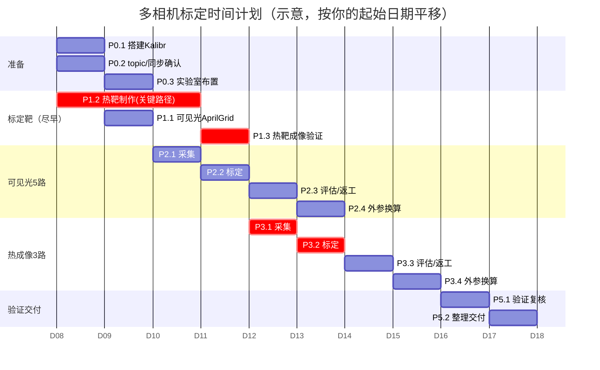

# 多相机标定项目 —— 工作任务拆分与时间计划

> 配套技术文档：[`5cam_extrinsic_calibration_tutorial.md`](./5cam_extrinsic_calibration_tutorial.md)
> 标定对象：**5 路可见光相机**（1080P，HFOV 52°，yaw 0/±45/±90°）+ **3 路 LWIR 热成像相机**（640×512，HFOV ≈58°，yaw 0/±35°）。
> 工具：Kalibr（本仓库），ROS1，实验室 ≈ 30 m²。

---

## 0. 总览

整个项目分两条**相互独立**的标定线（可见光 / 热成像），各自完整走一遍"目标→采集→标定→验证"，
最后做联合验证与交付。两条线的**目标制作**可以并行启动（热靶有制作周期，应最先开工）。

- **关键路径**：热成像标定靶制作 → 热成像数据采集 → 热成像标定。（热靶是唯一有"采购/加工周期"的硬件项。）
- **最大技术风险**：① 可见光 7° 窄重叠采集；② 热靶发射率反差是否够（AprilTag 能否检出）。
- **建议总工期**：约 **10 个工作日（2 周）**，含返工缓冲；若热靶外发加工，按供货周期顺延。

---

## 1. 工作分解结构（WBS）

| 编号 | 任务 | 主要交付物 | 依赖 | 预估工时 |
|------|------|-----------|------|---------|
| **P0 环境与准备** ||||| 
| P0.1 | 搭建 Kalibr（Docker / ROS1 工作区） | 可运行的 `kalibr_*` 命令 | — | 0.5 d |
| P0.2 | 确认 8 路相机 ROS topic、帧率、时间戳方案 | topic 清单 + 帧率表；无硬件同步 → 采用 [§1.2 走走停停](#12-无硬件同步的采集方案走走停停stop-and-go) 方案 | — | 0.5 d |
| P0.3 | 实验室布置：阵列居中、转台/三脚架、板架、照明 | 采集工位就绪 | — | 0.5 d |
| **P1 标定靶制作（尽早启动）** ||||| 
| P1.1 | 可见光 AprilGrid 打印+裱平（参数见 [§1.1.1](#111-可见光-aprilgridp11)） | 可见光靶 + `target.yaml`（实测 tagSize） | — | 0.5 d |
| P1.2 | 热成像发射率反差靶制作（参数见 [§1.1.2](#112-热成像-aprilgridp12--发射率反差靶)） | 热靶 + `target_thermal.yaml` | — | 1–3 d* |
| P1.3 | 热靶成像验证（`--show-extraction` 看检出率） | 检出 OK 的确认 / 改进意见 | P0.1, P1.2 | 0.5 d |
| **P2 可见光 5 路标定** ||||| 
| P2.1 | 数据采集：转台扫 4 条 7° 缝 + 逐台近距铺满像面 | `fivecam.bag` | P0.*, P1.1 | 1 d |
| P2.2 | 运行 `kalibr_calibrate_cameras`（内+外参联合） | `camchain-fivecam.yaml` 等 | P2.1 | 0.5 d |
| P2.3 | 结果评估 + 必要返工（补采/重标） | RMS<0.3px、yaw≈±45/±90° | P2.2 | 0.5–1 d |
| P2.4 | 外参换算为"相对 center" + 记录 | 外参表 + 脚本输出 | P2.3 | 0.25 d |
| **P3 热成像 3 路标定** ||||| 
| P3.1 | 数据采集：左中、中右两条 23° 重叠带 + 远近高低 | `ir3cam.bag` | P0.*, P1.3 | 0.5 d |
| P3.2 | 运行 `kalibr_calibrate_cameras`（3 路 pinhole-radtan） | `camchain-ir3cam.yaml` | P3.1 | 0.5 d |
| P3.3 | 结果评估 + 必要返工 | RMS 达标、yaw≈±35° | P3.2 | 0.5 d |
| P3.4 | 外参换算为"相对 center" + 记录 | 外参表 | P3.3 | 0.25 d |
| **P4（可选）IR↔可见光跨模态外参** ||||| 
| P4.1 | 双模态共视靶制作 + 桥接采集 | 双模态 bag | P2, P3 | 1 d |
| P4.2 | 求 `T_IR_RGB` 并验证 | 跨模态外参 | P4.1 | 0.5 d |
| **P5 验证与交付** ||||| 
| P5.1 | `kalibr_camera_validator` + 报告 PDF 复核（两套） | 验证记录 | P2, P3 | 0.5 d |
| P5.2 | 整理标定文件、参数表、操作记录、复现说明 | 交付包 | 全部 | 0.5 d |

> *P1.2 热靶：自制（铝板+黑胶带/哑光漆）约 1 天；若激光切割掩模板或外发加工，按供货周期 2–3 天甚至更久，**务必第一天就启动**。

合计纯工时 ≈ **8.5–10.5 人·天**（不含 P4 可选项与外发加工等待）。

> ⚠️ **采购/制作标定靶前，务必阅读下方 §1.1 规格明细**，按参数制作或下单。

### 1.1 标定靶规格明细（采购/制作参数）

> **需要几块板？** 可见光 5 路只需 **1 块** AprilGrid，热成像 3 路只需 **1 块** 热反差靶。不需要每个接缝各一块。
> Kalibr 不要求所有接缝同时被观测——板子依次移动到每条缝采集即可，多帧数据拼成完整外参链。
> **不要用多块相同 AprilGrid 同时摆放**：若某台相机视场内出现两块相同 tag ID 的板，Kalibr 会因重复 ID 报错或误关联。

以下是两套标定靶的完整技术参数，可直接用于打印店/加工厂下单。

---

#### 1.1.1 可见光 AprilGrid（P1.1）

| 参数 | 规格值 | 说明 |
|------|--------|------|
| **类型** | AprilGrid（apriltag） | Kalibr 原生支持，窄重叠场景下（7° 缝）优于棋盘格 |
| **Tag 家族** | **t36h11** | Kalibr 默认家族；36 种 tag ID、11 bit 最小汉明距，抗误检能力强 |
| **网格密度** (tagCols × tagRows) | **6 × 6** | 共 36 个 tag（0~35 ID），覆盖面积大，确保窄缝里也能命中边缘 tag |
| **单个 tag 边长** (tagSize) | **0.088 m (88 mm)** | tag 黑色正方形的物理边长；打印后**必须用卡尺实测**填入 `target.yaml` |
| **tag 间距比** (tagSpacing) | **0.3** | 白色边框宽度 ÷ tagSize = 0.088 × 0.3 = **26.4 mm**；Kalibr 生成脚本使用该默认比 |
| **有效图案区尺寸** | ≈ 0.686 m × 0.686 m | 6 × [88 × (1 + 0.3)] = 6 × 114.4 mm |
| **建议板材总尺寸** | **≥ 0.8 m × 0.8 m** | 含四周留白边距；板子越大，7° 缝中共享角点越多 |
| **板材材质** | 铝塑板 / 铝板 / 硬质亚克力板 | **刚性、平整**，不能弯曲翘曲（翘曲 → 系统误差） |
| **厚度** | ≥ 3 mm（铝塑板 ≥ 4 mm） | 保证刚性不弯 |
| **印刷方式** | 哑光写真裱板 / UV 平板喷印 | **必须哑光**，避免反光斑导致角点漏检 |
| **色彩** | 纯黑 tag + 纯白背景 | 高对比度；不要用灰度/渐变色 |
| **安装** | 四角打孔或背面装挂钩/挂架 | 便于固定在板架/三脚架上 |

**生成脚本**（安装 Kalibr 后运行，输出送印文件）：
```bash
kalibr_create_target_pdf --type apriltag \
  --nx 6 --ny 6 \
  --tsize 0.088 --tspace 0.3 \
  --tfam t36h11 \
  --eps target.eps
```
将生成的 PDF/EPS 送去写真裱板或 UV 打印。打印后**用卡尺实测 tagSize**（取多个 tag 的平均值），填入 `target.yaml`：

```yaml
target_type: 'aprilgrid'
tagCols: 6
tagRows: 6
tagSize: 0.088    # ← 改为打印实测值（m）！
tagSpacing: 0.3
```

**采购渠道建议**：
- 广告打印店：提供 PDF/EPS 文件，要求哑光写真裱铝塑板 / 裱硬质 KT 板
- 淘宝/线上：搜索「AprilTag 标定板 定制」「6×6 AprilGrid 标定靶」，提供以上参数表
- 自打印：A0 幅面打印机 + 裱在平整基板上（避免拼接）

---

#### 1.1.2 热成像 AprilGrid（P1.2 —— 发射率反差靶）

| 参数 | 规格值 | 说明 |
|------|--------|------|
| **几何参数** | **与可见光靶完全一致** | 6×6, tagSize=0.088 m, tagSpacing=0.3, t36h11。尺寸统一便于后续跨模态对标 |
| **基底材质** | **铝板 / 铝塑板**（裸铝面） | 裸铝发射率 ≈ 0.1，热图上偏"冷/暗" |
| **图案材质** | **哑光黑漆 / 哑光黑乙烯基贴膜** | 哑光黑发射率 ≈ 0.95，热图上偏"热/亮" |
| **图案实现方式（二选一）** | ① 铝底上做黑色 AprilTag 图案（推荐）<br>② 黑色底板上贴抛光铝箔做 tag（反相） | 方案①加工更简单；方案②适合已有黑底板的情况 |
| **图案加工精度** | 边缘切割整齐、边界锐利 | 热量横向扩散会模糊边缘，降低角点精度。推荐**激光切割黑色哑光不干胶**贴附 |
| **对比增强手段** | 拍摄前用热风枪/卤素灯均匀加热板面数十秒 | 发射率差异在有温差时被放大，黑色图案明显比铝底亮 |
| **厚度** | 2–3 mm（铝板）/ 3–4 mm（铝塑板） | 薄板热容量小，加热均匀、对比平衡快 |
| **表面处理** | 避免镜面反射 | 裸铝镜面会反射人体/热源形成杂斑；拍摄时人站相机侧后方 |

**⚠️ 验收标准（P1.3 用）**：
加工完成后，必须在热像仪下运行以下命令确认 **AprilTag 能被稳定检出**（绿色角点贴合 tag 顶点）：
```bash
kalibr_calibrate_cameras --target target_thermal.yaml --show-extraction ...
```
检不出 = 不合格，需排查：对比度不够（加热不足/材质发射率差）→ 边缘模糊（热扩散/加工粗糙）→ 镜面反射杂斑 → 更换方案。

**加工渠道建议**：
- **推荐**：广告店激光切割黑色哑光不干胶（精度高、边缘锐利）→ 贴在铝板上
- 备选：自购哑光黑漆 + 镂空模板喷制（精度较低）
- 高端：CNC/激光加工厂在铝板上做黑色阳极氧化/涂层（最耐用但成本高、周期长）

**target_thermal.yaml 格式**与可见光 `target.yaml` 完全一致（`tagSize` 按热靶实测值填写）。

---

### 1.2 无硬件同步的采集方案——"走走停停"（Stop-and-Go）

> 适用场景：**8 路相机没有硬件触发同步**，时间戳来自各相机独立时钟。

**原理**：标定板在三角架上完全静止 ≥ 3 秒，期间所有相机拍到的是同一个静态场景。
即使各路时间戳相差数百毫秒，Kalibr 的 `--approx-sync` 将它们配成一组时，几何关系仍是正确的。
（反之边走边拍会导致各相机拍到板子在不同位置，外参失准。）

#### 操作流程（单次循环）

```
① 移动三脚架到目标位置     (~5 s)
② 标定板完全静止，≥3 秒    (心里默数 1001,1002,1003)
③ 微调角度/倾斜/距离      (~5 s)
④ 标定板完全静止，≥3 秒
... 重复 ①-④，直到该区域覆盖完毕
```

**关键要点**：

| 事项 | 说明 |
|------|------|
| **全程不中断录制** | 一条 `rosbag record` 从头录到尾，事后用 `--bag-from-to` 或 `--bag-freq` 去冗余 |
| **静置时间 ≥ 3 秒** | 帧率 10 fps → 至少 30 帧/位置；实际 3 秒可覆盖 4~30 fps 所有情况 |
| **移动与静置之间有明显间隔** | 建议静置前轻拍板子一下（制造小震动）——事后回看 bag 时，通过运动模糊区分"移动帧"和"静止帧"，方便裁切 |
| **`--approx-sync` 设大** | 静止场景下宽容度大，建议 `0.1~0.5`（默认 0.02 偏小）。设大增加配对成功率，不影响精度 |
| **标定板固定** | 三脚架 + 板架夹持牢固，静置期间不能有微风/触碰导致的微动 |
| **照明稳定** | 静置期间光照不能变化（人走过遮挡、开关灯等） |
| **热靶额外注意** | 每静置几个点位后补热一次（热风枪/卤素灯数秒），防止热平衡后对比下降 |

#### 采集点位规划

**可见光 5 路（4 条 7° 缝）**：

| 缝 | 方位角（相对阵列中心） | 距离 | 静止位数量 | 备注 |
|----|----------------------|------|-----------|------|
| left2 ↔ left1 | ±67.5°（侧后方） | 2.0–2.5 m | 15–20 个 | 每个位微调俯仰/侧倾 ±15° |
| left1 ↔ center | ±22.5°（侧前方） | 2.0–2.5 m | 15–20 个 | 同上 |
| center ↔ right1 | ±22.5° | 2.0–2.5 m | 15–20 个 | 同上 |
| right1 ↔ right2 | ±67.5° | 2.0–2.5 m | 15–20 个 | 同上 |
| **内参补充** | 各相机正前方 | 0.8–1.5 m | 5–10 个/台 | 板子铺满像面，可手持快速扫 |

> 每个缝约 15–20 个静止位 × 4 条缝 ≈ **60–80 个静止位**。每个位静置 3 s + 移动 5 s ≈ 8 s/位，
> 总计 8–11 分钟纯采集时间。加上内参补充，可见光采集约 **15–20 分钟**。

**热成像 3 路（2 条 23° 缝，重叠充裕）**：

| 缝 | 方位角 | 距离 | 静止位数量 |
|----|--------|------|-----------|
| left ↔ center | ≈17.5° | 1.5–2.5 m | 15–20 个 |
| center ↔ right | ≈17.5° | 1.5–2.5 m | 15–20 个 |
| **内参补充** | 各相机正前方 | 0.8–1.5 m | 5–10 个/台 |

> 热成像采集约 **10–15 分钟**。注意每几个静置位后补热板面。

#### 标定命令中的同步参数

```bash
# 可见光（无硬件同步 → approx-sync 放宽）
kalibr_calibrate_cameras \
  --bag fivecam.bag \
  --topics /cam0/image_raw ... /cam4/image_raw \
  --models pinhole-radtan ... \
  --target target.yaml \
  --approx-sync 0.3          # ← 关键：静止场景下设 0.3 s，充分宽容各路时间戳偏差

# 热成像同理
kalibr_calibrate_cameras \
  --bag ir3cam.bag \
  --topics /ir_left/image_raw /ir_center/image_raw /ir_right/image_raw \
  --models pinhole-radtan pinhole-radtan pinhole-radtan \
  --target target_thermal.yaml \
  --approx-sync 0.3
```

#### 事后裁切有效段（可选，减小 bag 体积）

录制时全程不中断，录完后用 `rosbag info` 查看起止时间，回放找到"首个静止位开始"和"最后一个静止位结束"的时间戳，标定时用 `--bag-from-to` 只取有效段：

```bash
kalibr_calibrate_cameras \
  --bag fivecam.bag \
  --bag-from-to 10.0 1200.0 \
  ...
```

如果不裁切也无妨——Kalibr 通过角点提取自然会跳过"移动中帧"（运动模糊检不出角点），只是处理时间稍长。

---

## 2. 时间计划（建议 2 周 / 10 个工作日）

按"热靶先行、可见光与热成像两线推进、最后统一验证"安排：



**逐日参考排期（单人/小团队，串行偏多时）：**

| 工作日 | 上午 | 下午 |
|--------|------|------|
| D1 | P0.1 搭 Kalibr、P0.2 topic/同步 | **P1.2 启动热靶制作**、P1.1 可见光靶 |
| D2 | P0.3 实验室布置 | 热靶制作继续；可见光靶裱平、量 tagSize |
| D3 | P2.1 可见光采集（转台扫缝） | P2.1 续：逐台近距铺满像面 |
| D4 | P2.2 可见光标定 | P2.3 评估，按需补采 |
| D5 | P1.3 热靶成像验证（检出 OK?） | 热靶不达标则改进返工（加热/换材质/锐边） |
| D6 | P3.1 热成像采集 | P3.2 热成像标定 |
| D7 | P3.3 评估/返工 | P2.4 + P3.4 外参换算、记录 |
| D8 | P5.1 两套验证复核 | P5.2 整理交付包 |
| D9–D10 | 机动缓冲：返工、（可选）P4 跨模态 | 文档/复现说明定稿 |

> 若**两人并行**（一人管硬件/采集，一人管标定/脚本），可压缩到 **6–7 个工作日**：
> 可见光线（P2）与热成像线（P3）在热靶就绪后并行推进。

---

## 3. 里程碑（Milestone）

| 里程碑 | 判定标准 | 目标日 |
|--------|---------|--------|
| M1 环境就绪 | Kalibr 可跑、8 路 topic 正常出帧、同步方案确定 | D2 末 |
| M2 标定靶就绪 | 可见光靶 OK；**热靶 AprilTag 在热图上可稳定检出** | D5 末 |
| M3 可见光标定通过 | RMS<0.3px，yaw≈±45/±90°，畸变≈0 | D4–D5 |
| M4 热成像标定通过 | RMS 达标，yaw≈±35° | D7 |
| M5 交付完成 | 两套 `camchain` + 外参表 + 验证报告 + 复现说明 | D8（缓冲至 D10）|

---

## 4. 风险与对策

| 风险 | 影响 | 概率 | 对策 |
|------|------|------|------|
| **热靶发射率反差不足，AprilTag 检不出** | 热成像标定无法进行 | 中-高 | 第一天就做热靶并尽早 P1.3 验证；备多种材质方案（黑胶带/哑光漆/镂空掩模+加热）；预留返工日 |
| **可见光 7° 窄重叠采不到公共角点** | 链不连通，标定报错 | 中 | 用转台让缝精确扫过大板；每条缝多停留；`--show-extraction` 实时确认；大尺寸靶 |
| **5 路/3 路时间不同步** | 板运动时角点错位、误差大 | **低**（已规避） | 采用 [§1.2](#12-无硬件同步的采集方案走走停停stop-and-go) 走走停停方案：每位置静置 ≥3 s，`--approx-sync 0.3`。板子静止期间时间戳偏差不影响几何精度 |
| **30 m² 场地够不到侧后方缝** | ±67.5° 缝顶墙 | 中 | 阵列居中、半径压到 2.0–2.5 m（见教程 §5.5）；用转台规避 |
| **热靶外发加工周期长** | 整体延期 | 中 | D1 启动；同时自制应急版（铝板+黑胶带）保底 |
| **IR 镜头畸变大、去畸变未知** | 内参不收敛 | 低-中 | 用 `pinhole-radtan` 联合估畸变；近距铺满像面补内参约束 |

---

## 5. 资源清单（Checklist）

- [ ] 计算机 + Docker/ROS1，Kalibr 镜像已 build
- [ ] 8 路相机供电、数据链路、ROS 驱动（topic 正常）
- [ ] 时间戳确认：各路相机 ROS 时间戳正常（无需硬件同步，走走停停方案见 §1.2）
- [ ] 可见光 AprilGrid 大靶 **×1 块**（6×6 t36h11, tagSize=88 mm, tspace=0.3, 板材≥0.8 m, 哑光裱铝塑板）+ 卡尺
- [ ] 热成像反差靶 **×1 块**：铝板/铝塑板基底 + 激光切割哑光黑膜 AprilGrid 图案（6×6 t36h11, tagSize=88 mm, tspace=0.3）+ 热风枪/卤素灯
- [ ] 转台/旋转云台 + 三脚架 + 板架
- [ ] 均匀照明（可见光）、避反射布置（热成像）
- [ ] 存储空间（多路 1080P bag 体积较大）

---

## 6. 交付物（Deliverables）

1. `camchain-fivecam.yaml`、`results-cam-fivecam.txt`、`report-cam-fivecam.pdf`
2. `camchain-ir3cam.yaml`、`results-cam-ir3cam.txt`、`report-cam-ir3cam.pdf`
3. 外参汇总表（各相机相对各自 center 的 R/t 与 yaw/pitch/roll）
4. （可选）`T_IR_RGB` 跨模态外参
5. 采集与标定操作记录 + 复现说明（命令、参数、靶参数）
